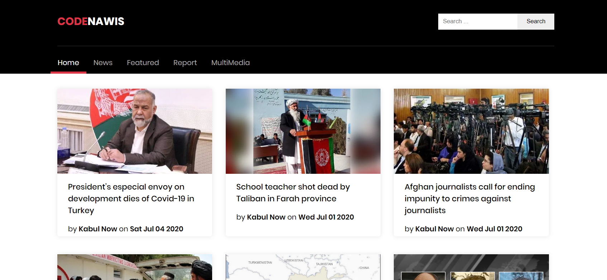

# CodeNawis Frontity Theme Project :art:

:fire: A Frontity Theme for Wordpress site.

# More than Mars Theme
1. Sharing Buttons
2. Category based Posts in Homepage
3. Comment Section in Single Post Page
4. Grid System
5. Search
6. Categories in Navbar
7. Tags in post page
8. Better Pagination
9. Footer

:zap: Check out the [demo site here](http://newschin.mymakarim.vercel.app//).

# Demo 

<p align="center">
  
</p>
<p align="left">
  
</p>

# Installation :wrench:

## 1. For new projects: clone this project.

1. `git clone https://github.com/mymakarim/frontity-codenawis`.
2. `cd frontity-codenawis`.
3. `npm install && npx frontity dev` (from the project's root directory).

4. Your site will now be available at `http://localhost:3000/`

## 2. For new/existing project: use npm.

1. `npm install @frontity/codenawis`.
2. Add the package in `frontity-settings.js`.

```javascript
  packages: [
    {
      "name": "@frontity/codenawis",
      "state": {
        "theme": {
          "menu": [
            [
              "Home",
              "/"
            ],
            [
              "News",
              "/category/news/"
            ],
            [
              "Featured",
              "/category/featured/"
            ],
            [
              "Report",
              "/category/report/"
            ],
            [
              "MultiMedia",
              "/category/multimedia/"
            ],
            [
              "About Us",
              "/about/"
            ]
          ],
          "featured": {
            "showOnList": true,
            "showOnPost": true
          }
        }
      }
    },
```

3. go to `packages/codenawis/src/components/utility/config/homepageSections.js` and put the `categoryID` and `slug` of the categories you want them to appear as sections in the homepage

4. Remove your previous theme (`mars-theme`?) from `frontity-settings.js`.
5. `npx frontity dev` (from project's root directory).
6. Your site will be available at `http://localhost:3000/`.

## Credits :white_flower:

- Build with love :blue_heart:, using [Frontity's](https://frontity.org) [mars-theme](https://www.npmjs.com/package/@frontity/mars-theme) as base.

## Authors

1. [Yahya Makarim](https://instagram.com/codenawis)

## License :scroll:

[](https://opensource.org/licenses/MIT)  